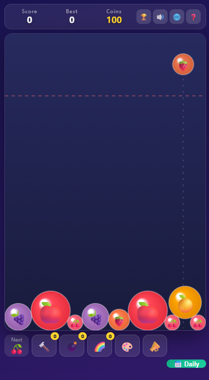

# Fruit Merge King

**Fruit Merge King** is a free, open-source fruit merge game in the style of
Suika / the watermelon game. Drop fruits, merge matching pairs and grow the
ultimate watermelon — right in your browser, on desktop and mobile.

▶️ **Play online (free, no download):** https://fruit-merge-game.vercel.app



## Features

- Physics-driven merging on a fixed-timestep simulation (frame-rate independent)
- Combo scoring with a 2-second chain window
- Coin economy with three consumable tools: level hammer, bomb, rainbow orb
- Four unlockable skins (fruit / pets / planets / sweets)
- 11 achievements
- Daily check-in with a 7-day reward cycle and streaks
- End-of-run share card rendered on canvas, shareable via Web Share API or clipboard
- Localized UI: English, 简体中文, 日本語, Español — browser language autodetect
- Progress saved to localStorage
- Sound effects synthesized live with WebAudio; the repo ships no binary assets


## Getting started

ES modules won't load over `file://`, so serve the folder with any static
server:

```bash
npx serve
# or
python3 -m http.server 8080
```

## FAQ

**Is it free?** Yes — fully free and open source (MIT), no ads.
**Does it work on phones?** Yes, touch controls included.
**Can I play offline / host it myself?** Yes, it's a static site — clone and serve.
**What is a Suika game?** A merge-puzzle genre where identical items combine into bigger ones; the original Japanese watermelon game went viral in 2023.
